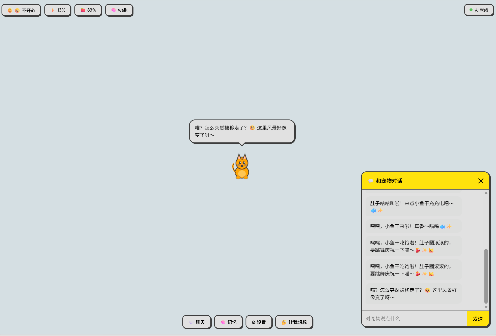

# CogPet 🐾

> An autonomous AI pet that lives in your browser — it moves, creates, talks, and remembers.

浏览器里的小生命。不是被你控制的 — 它自己决定做什么。

## 截图



## ✨ 特性

| 功能 | 说明 |
|------|------|
| 🧠 **AI 自主决策** | 每隔几秒询问 LLM，根据能量、饱腹、心情、记忆自主决定行为 |
| 🎨 **屏幕创造** | 在页面上生成食物、玩具、花朵、装饰品，和它共存在屏幕上 |
| 💬 **有记忆的对话** | 记住你说过的每句话和它做过的每件事，对话有完整上下文 |
| 🐾 **5 种宠物** | 猫、狗、兔子、小鸟、仓鼠，各有独特手绘造型 |
| 🎭 **流畅动画** | 挥手、弹性跳跃、跳舞（带音符粒子）、转圈、睡觉、吃东西 |
| 👔 **自定义外观** | 10 种主题色、5 种服饰（帽子/蝴蝶结/围巾/墨镜/皇冠）、7 种表情 |
| 🌐 **零依赖** | 单个 HTML 文件，纯 Canvas 绘制，无任何框架 |

## 🚀 快速开始

### 1. 准备 LM Studio

下载 [LM Studio](https://lmstudio.ai)，加载任意聊天模型。

启动时添加 CORS 参数：

```bash
lmstudio --cors-allowed-origins "*"
```

或在 LM Studio 设置中允许所有来源的跨域请求。

### 2. 运行

直接打开 `pet.html`：

```bash
# 方式一：直接打开（可能有 CORS 问题）
open pet.html

# 方式二：本地服务器（推荐）
npx serve .
# 或
python -m http.server 8080
```

访问 `http://localhost:3000/pet.html`（serve）或 `http://localhost:8080/pet.html`（python）。

### 3. 配置

页面右下角 ⚙ 设置面板可以修改：

- **AI 模型地址** — 默认 `http://192.168.100.100:1234/v1/chat/completions`
- **模型名称** — 默认 `qwen/qwen3.5-4b`
- **决策间隔** — 宠物多久思考一次（默认 10 秒）

> ⚠️ **使用本地小模型时**：请务必关闭模型的**思考/推理模式（Thinking Mode）**。
> 小模型开启思考后会输出大量无关内容，导致 JSON 解析失败，宠物行为完全不正常。
> 在 LM Studio 中加载模型时，取消勾选 "Enable Thinking" 或类似选项。

## 🎮 交互方式

| 操作 | 效果 |
|------|------|
| **拖拽** | 抓住宠物拖到新位置 |
| **点击屏幕物品** | 宠物会走过去和它互动 |
| **💬 聊天** | 和宠物对话，它会回应并记住 |
| **🧠 让我想想** | 强制触发一次 AI 决策 |
| **🧠 记忆** | 查看宠物的记忆时间线 |

## 🧩 它是怎么工作的

```
┌─────────────────────────────────────────────┐
│  每隔 N 秒                                    │
│                                               │
│  发送: 当前状态 + 记忆 + 用户消息              │
│  ┌───────────┐                                │
│  │  LLM API  │ → 返回 JSON: 动作 + 说话 + 表情 │
│  └───────────┘                                │
│                                               │
│  执行: 移动 / 创造物品 / 跳舞 / 聊天 / ...     │
│  记录: 写入记忆池，下次决策时一起发给 LLM       │
└─────────────────────────────────────────────┘
```

### 可用动作

- `idle` 发呆 | `walk` 散步 | `wave` 挥手 | `jump` 跳跃
- `dance` 跳舞 | `sleep` 睡觉 | `eat` 吃东西 | `spin` 转圈
- `create` 创造物品 | `interact` 和屏幕上的东西互动

### 可创造的物品

| 类型 | 内容 | 互动方式 |
|------|------|---------|
| 🍎 食物 | 🍊🍌🍇🍓🥕🍰🧁🍩🐟🍖 | 走过去吃掉（恢复饱腹度） |
| ⚽ 玩具 | 🎈🪁🎯🧶🪀🎮 | 走过去玩 |
| 🌸 自然 | 🌺🌻🌹🍀🌿⭐🌙☁️🦋 | 走过去欣赏 |
| ✨ 装饰 | 💖🌟🎀🔮💎🏆 | 走过去看 |
| 🛋️ 家具 | 📚💡🖼️🧸🪴 | 走过去使用 |

### 记忆系统

所有交互和行为都记录在统一的记忆池中：

```
[14:32:05] (pet-speech) 肚子饿了~吃点东西🍎
[14:32:05] (pet-action) 我决定吃东西
[14:32:15] (pet-speech) 好吃！🤤 🍎
[14:33:01] (user-chat) 你好呀
[14:33:02] (pet-speech) 你好呀~ (◕ᴗ◕✿)
```

每次 LLM 决策时，最近 20 条记忆会作为上下文发送，让宠物能延续话题、引用之前的经历。

## 📁 项目结构

```
pet.html    ← 就这一个文件，所有逻辑都在里面
README.md
LICENSE
```

## 🔧 技术栈

- **渲染**: HTML5 Canvas（手绘像素风格）
- **AI**: OpenAI 兼容 API（支持 LM Studio、Ollama、vLLM 等）
- **依赖**: 无。零框架，零 npm 包，单文件运行。

## 📄 License

MIT
